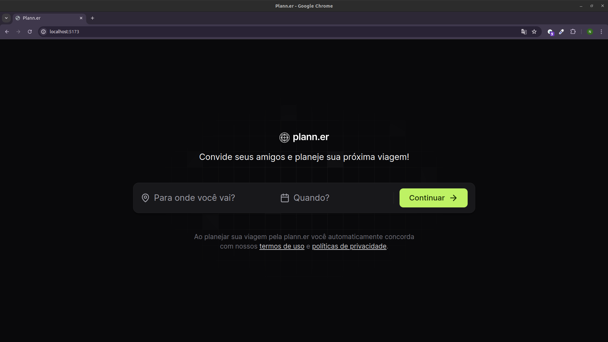
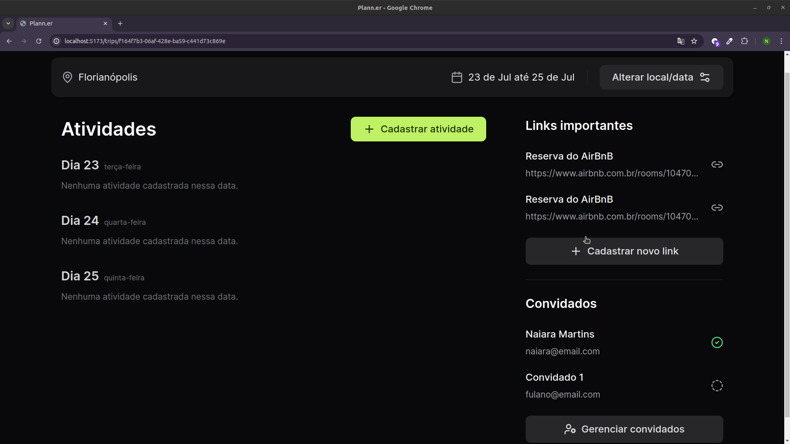

# 🚀 Next Level Week - Planejador de Viagens

## 📖 Sobre o Projeto

Este projeto faz parte da 16ª edição do Next Level Week (NLW), o maior evento de programação na prática, organizado pela Rocketseat. Durante o evento, desenvolvemos um planejador de viagens na trilha de React. Foram 3 aulas de muito código!

## 🛠 Tecnologias Utilizadas

- **React**
- **Axios**
- **Date-fns**
- **React Router**
- **Lucide-react**
- **React-day-picker**
- **HTML/Tailwind CSS**
- **JavaScript/TypeScript**

## 🗓️ Estrutura das Aulas

### Aula 1: Início da Especialização na Prática
Na primeira aula, além de conhecermos o projeto, colocamos a mão na massa e demos os primeiros passos no desenvolvimento do planejador de viagens. 

#### Conteúdos Abordados:
- Preparação do ambiente de desenvolvimento
- Instalação das dependências necessárias
- Criação da estrutura inicial do projeto
- Fundamentos do React e criação de componentes básicos

### Aula 2: Avançando no Desenvolvimento
Nessa segunda aula avançamos no desenvolvimento do projeto e aceleramos o aprendizado: aprender enquanto desenvolve um projeto é o caminho mais rápido para ganhar experiência na tecnologia além de conhecer as possibilidades dessa tecnologia poderosa!

#### Conteúdos Abordados:
- Criação de rotas com React Router
- Hooks para gerenciamento de estado
- Estilização dos componentes

### Aula 3: Finalizando o Projeto
Nesta aula fizemos a comunicação com a API e fizemos os últimos ajustes no projeto, finalizando as funcionalidades para concluir a missão.

#### Conteúdos Abordados:
- Implementação de funcionalidades
- Integração com API utilizando Axios
- Ajustes finais e correção de bugs

## 🚀 Funcionalidades

- Planejamento de viagens com definição de destino e datas
- Visualização e edição de viagens planejadas
- Integração com API para armazenamento de dados
- Interface amigável e responsiva

## 📷 Capturas de Tela

### Tela Inicial


### Planejamento de Viagem


## 🔧 Passo a Passo para Clonar e Rodar o Projeto

Siga os passos abaixo para clonar o repositório, instalar as dependências e iniciar o servidor do projeto:

### Pré-requisitos

- Git
- Node.js (versão 14 ou superior)
- npm ou yarn

### Passo 1: Clonar o Repositório

Clone o repositório do GitHub para o seu ambiente local:

```bash
git clone git@github.com:naiaraxavier/nlw-journey-react.git

```

### Passo 2: Navegar até o Diretório do Projeto
Entre no diretório do projeto clonado:

```bash
cd nlw-journey-react
```

### Passo 3: Instalar as Dependências
Instale as dependências do projeto usando npm ou yarn:


```bash
# Usando npm
npm install

# Usando yarn
yarn install
```

### Passo 4: Iniciar o Servidor de Desenvolvimento
Inicie o servidor de desenvolvimento para ver o projeto em funcionamento:

```bash
# Usando npm
npm run dev 

# Usando yarn
yarn run dev
``` 

### Passo 5: Acessar a Aplicação
Abra o navegador e acesse http://localhost:5173 para ver a aplicação em execução.

## 🏆 Conclusão

Durante essas 3 aulas intensivas, exploramos as funcionalidades poderosas do React e desenvolvemos um planejador de viagens completo. Esse projeto demonstra as habilidades adquiridas em React.

Feito com ❤️ por mim acompanhando as aulas do evento organizado pela [Rocketseat](https://www.rocketseat.com.br/).
